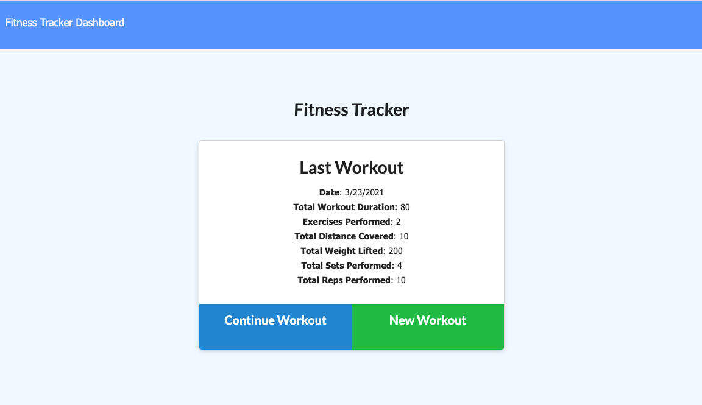

# WorkoutTracker
#### This is an application that allows users to log exercises.

### This application involves a database, so I have deployed in on Heroku. The project has been divided up into a public folder (with css, js and html files) and back end files which handle the server and database. Using this application, user can keep track of their workouts, and look at metrics from their previous workout, as well as charts which display information about their workouts over time. The user can enter workouts that fall into categories of cardio and resistance. The user can also continue a workout that is already in progress. 

### Link to deployed application: [Fitness Tracker](https://ancient-forest-84874.herokuapp.com/)
### 
